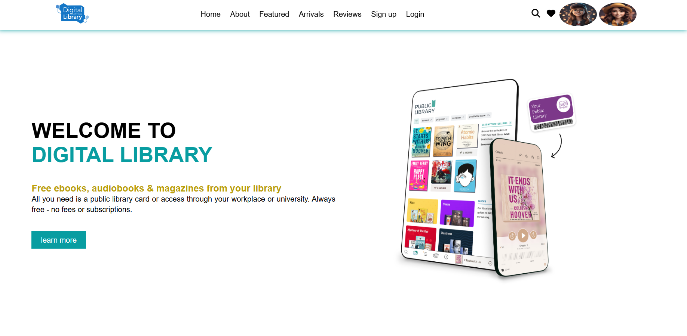
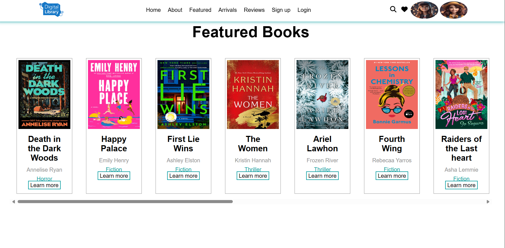
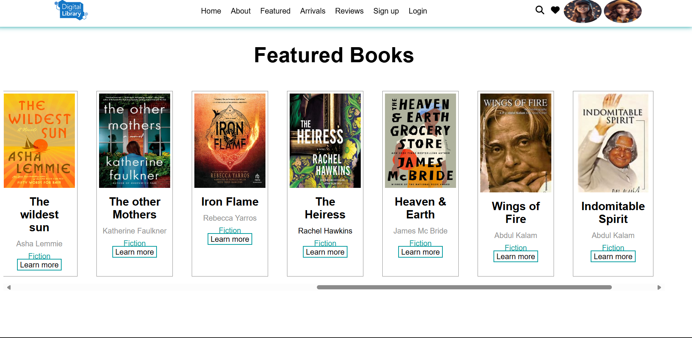
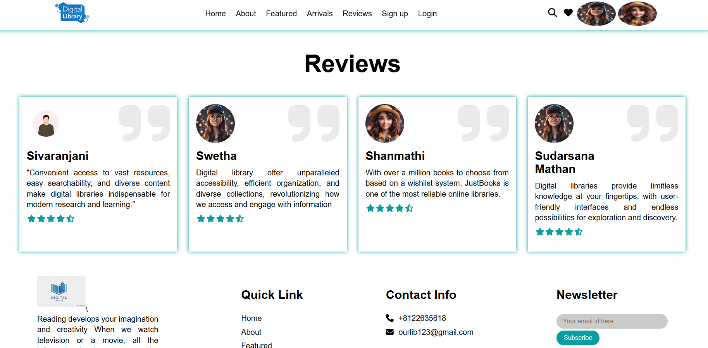
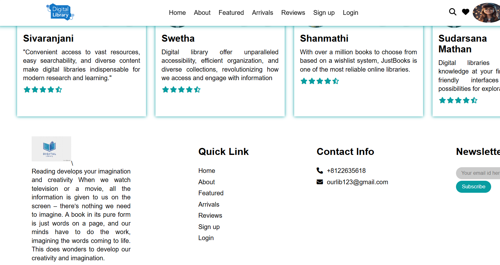

# website_into_the_Digital_Library
About : A webpage using HTML,CSS.

 This project is dedicated to providing our best to learners. 
 Below is a detailed overview of the content and features available on our website.

# Overview
A digital library is a repository of digital content that can be accessed and retrieved electronically.
Accessibility: Provides access to information and resources from anywhere at any time.
Efficiency: Facilitates easy search, retrieval, and management of information.
Cost-Effectiveness: Reduces the need for physical storage and maintenance.

View the webpage :

**FEATURES**

We have also provided links to explore more.
Learn about new features and arrivals of best books.
Subscribe to more  and more ................

**ADDITIONAL**

 Informatiom about
  + New Arrivals
  + Common ways to find a best books

Do Explore all the other pages provided in our websites.

“Explore our site’s universe—each page reveals a new frontier of digital library discovery!”
